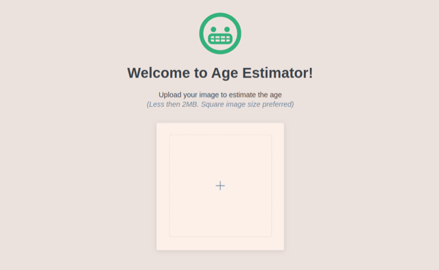
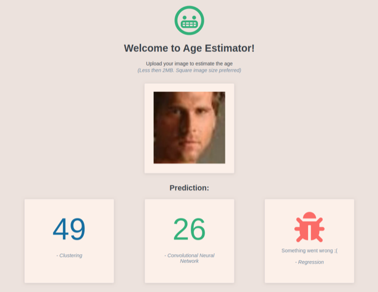

# Age Estimator

Estimate the age based on human facial images. To perform the task, we use 3 different machine learning models:

- Regression
- Clustering
- Convolutional Neural Network

_(NOTE: this project is under development!)_

## Preview

## Data

Datasets used for this project are large enough (> 100,000 samples and > 100 features, i.e., > 10M non-zeros) to train the model. We combine the following 2 datasets and unify their dimensions.

- [CACD](https://bcsiriuschen.github.io/CARC/) (160k)
- [UTKFace](https://susanqq.github.io/UTKFace/) (20k)
